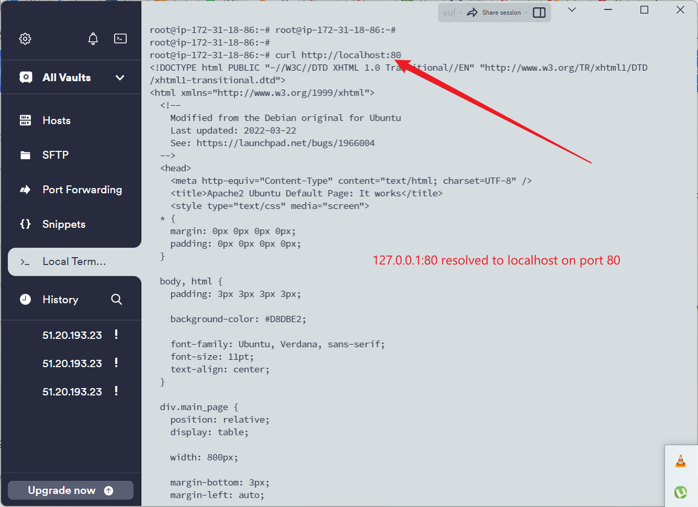

## LAMP STACK PROJECT

EC2 has been created since my first class with private key downloaded on my local machine to connect to my ec2 instance using termius or putty.

### Connection to EC2

### Sudo apt update

### Apache2 web server installation
The command "sudo apt install apache2" is used to install apache web server on the linux machine.

### Status of Apache web server
To check or know whether your server is up and running, you run this command "sudo systemctl status apache2"

### Allow port 80
For my apache server to be reachable on the internet, i must therefore create an allow rule in the security framework on aws.

### curl http://localhost:80

### curl http://127.0.0.1:80

### Apache HTTP server is now reachable over the internet.
This is achieveable using the public ip address from aws platform.

### Mysql installation
mysql server is install using the command "sudo apt install mysql-server"

### MYSQL Console
To log in to the mysql console/monitor, the command "sudo mysql" is used.

### mysql native password
To define a password for mysql database server, the command is on the image below.

### Interactive script
To start interactive script, i ran the command "sudo mysql_secure_installation

### To login to mysql
The command "sudo mysql -p" is used to login to mysql requesting a password.

### PHP Installation

### To check the version of PHP package
To check the version of the php installation, the command is "php -v"

### PHP site

### Apache Virtualhost

### Apache Virtualhost page

