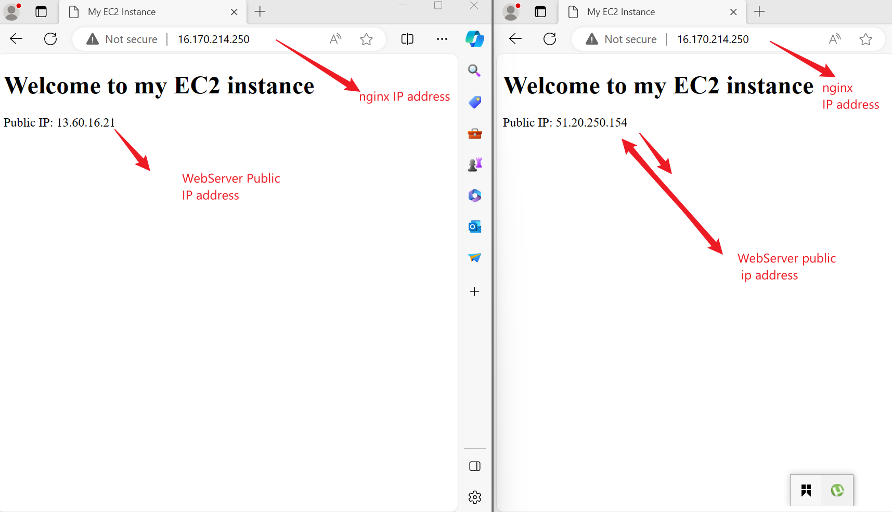

## _Automating Loadbalancer Configuration with Shell Scripting

### _shell script to setup our Apache web server_

The script has shown in the image was used to setup our EC2 web-servers.

### _status of web-server_

The image shown in our output shows the status of one of our web-servers. The output shows a webserver is active and running.

### _systemctl status apache2 to determine webserver status.

The command "sudo systemctl status apache2" was used to determine the status of our webserver as we can see in the output.

### _The script bash for setting up our webserver_

The script to setup the webserver is seen in the image displayed.

### _Installation of nginx and status of the webserver_

Using the script in our project assignment, we are able to install nginx successfully. This is active and running as seen in the image.

### _successful installation of the webserver and webpage outcome_

The image shows the installation was done successfully as we can the outcome on the webpage.

### _successful installation of the second webserver_

The image shows the installation was done successfully as we can the outcome on the webpage with the respective IP address.

### _outcome of nginx load balancer_

 The image above shows the successful deployment of nginx load balancer with shell scripting. A careful look of those pages shows what have been learnt so far using nginx webserver as a load balancer for the 2 EC2 web-servers. 