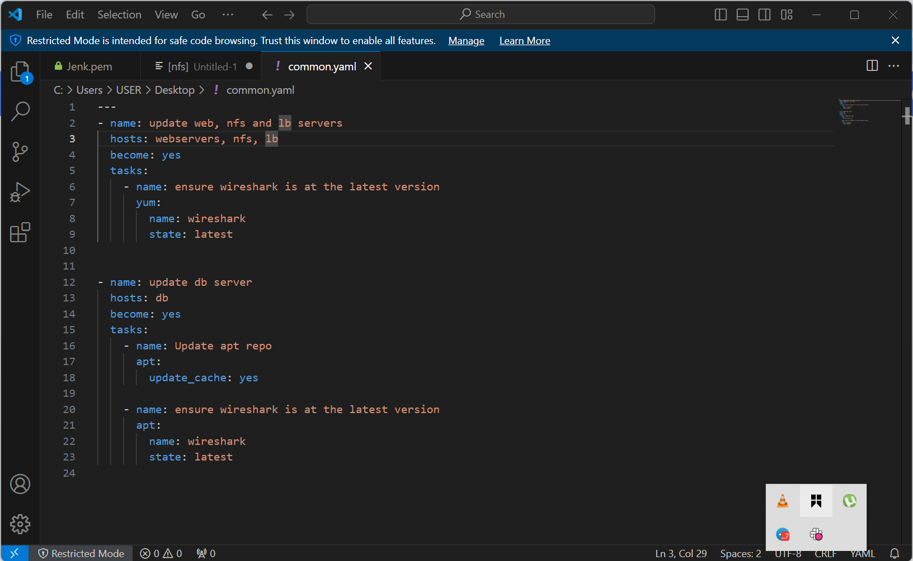
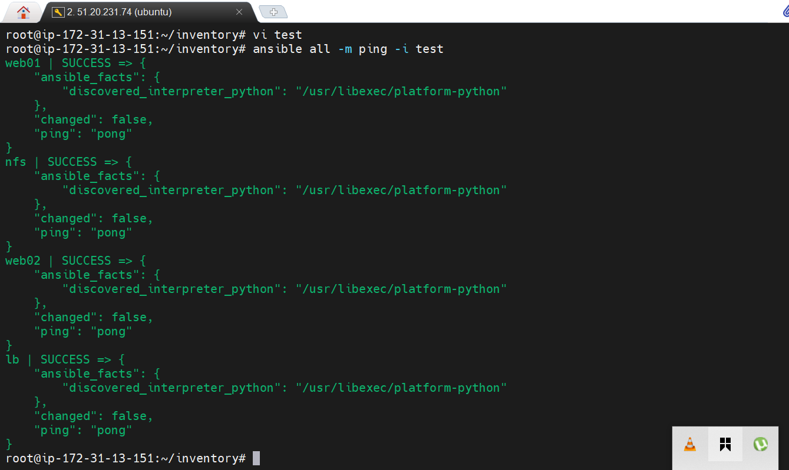
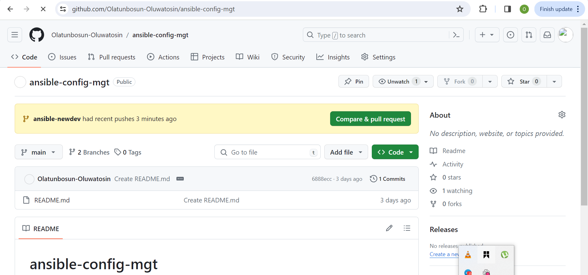
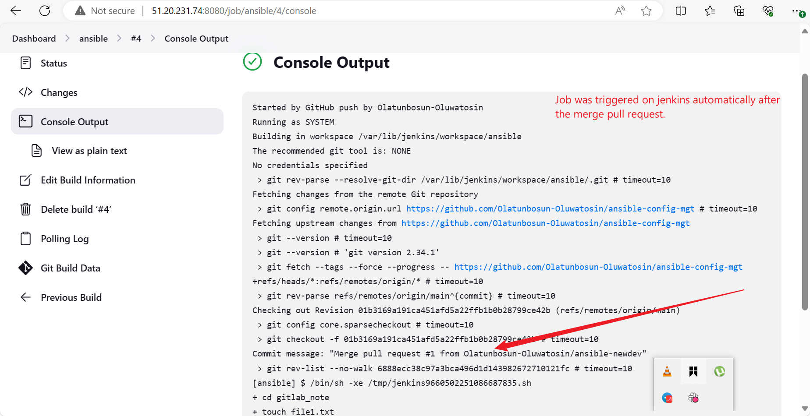
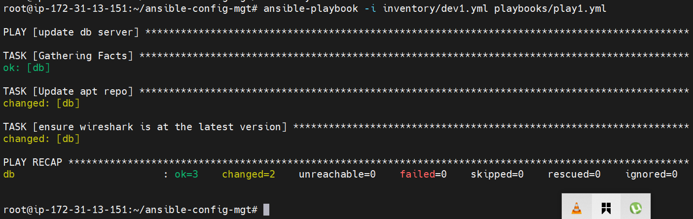
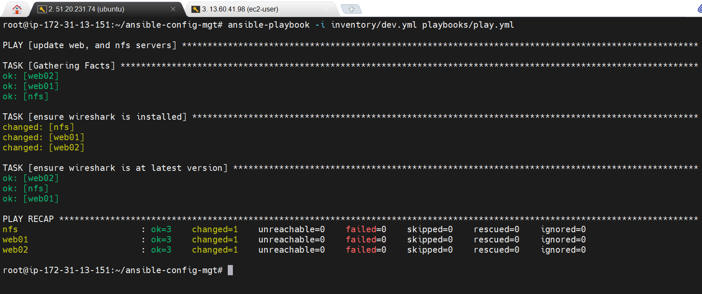

## _Ansible-Automate Project_

### _Installation of ansible_

Ansible was successfully installed on jenkins-server using the comand below.
"sudo apt update" &&
"sudo apt install -y ansible"

### _ansible-config-mgt_

A freestyle job was initiated on jenkins with webhook set to tigger ansible build and this was done successfully.

### _git clone repo_

This task was completed using the command "git clone <ansible-cinfig-mgt repo link> as seen in the image.

### _new branch created_

To begin ansible development, a new branch was expected to be created according to the manual guide. This was done as seen in the image and the name of the new branch is "ansible-newdev".

### _checkout new branch_

New branch checkout was done

### _creation of directories_

According to the guide, we are expected to create directories, "playbooks" & "inventory" in ansible-config-mg.

### _dev inventory_

These are the values of the hosts.

### _playbook tasks_

This yaml file contain the tasks for the playbook which captured all the hosts in consideration.

### _ping module_

This shows a successful ping module request to the hosts(web01, nfs, lb, & web02)

### _pull request_

pull request initiated from the new repository "ansible-config-mgt".

### _merge tasks_

### _job triggered in jenkins_

After the pull request and merge on github, the job automatically triggered on jenkins due to webhook integration.

### _DB-server playbook_

The playbook was executed correctly without error.

### _playbook for webservers & other host_

This was done and executed approriately without error.

### _wireshark version_

This shows that wireshark was installed on the host with the playbook.

Thank you

