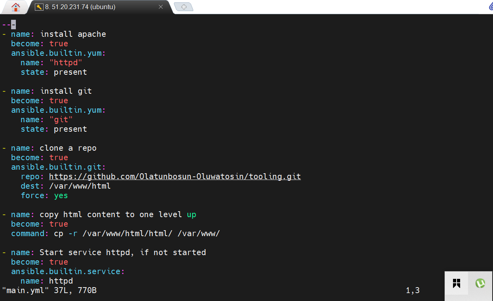
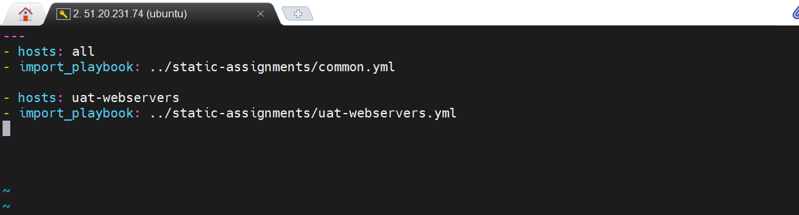

## _Ansible Refactoring and Static Assignments_

### _Jenkins job enhancement_

A new jenkins project/job was introduced to enhance the process in jenkins which require _copy artifact_ plugin. A new directory was created using "sudo mkdir /home/ubuntu/ansible-config-artifact" and a change permission to this same directory using "chmod -R 0777 /home/ubuntu/ansible-config-artifact". Through the jenkins homepage, the plugin _"copy artifact"_ was installed. A new freestyle project named "save_artifacts" was created which is to be triggered with an existing _ansible_ project. A change was made to the README.MD in the online repo "ansible-config-mgt" and as the build triggered automatically, the output was pointed to /home/ubuntu/ansible-config-artifact directory. 

### _A successful build job_

When the change was made to the README.MD file in the online Repo, a build job was triggered in jenkins and the output is what is in the image above.
### _structure for the new directory_

A new directory and file was introduced for ansible refactor; dir: static-assignments
file: site.yml

### _Refactor ansible code by importing other playbooks into site.yml_

existing _common.yml_ file was moved into the newly created _static-aassignments_. Inside _site.yml_ file, import _common.yml_ playbook through:

---
- hosts: all
- import_playbook: ../static-assignments/common.yml

with the necessary input according to the manual/guide, ansible playbook run against the _dev_ servers using the ansible command below;
"ansible-playbook -i inventory/dev playbooks/site.yaml"
### _output of the ansible-playbook_

The playbook is to execute a delete/remove command of wireshark application on the webservers, db and others. This playbook played successfully  
### _role webserver_

A directory called roles/ was created and using an ansible utility called _ansible-galaxy_ inside ansible-config-mgt/roles. The command  _"ansible-galaxy init webserver"_ was deployed.

### _playbook to install apache webserver & other_

Inside the roles/ directory is webserver which accomodate other directories created using the ansible utility. _main.yml_ is the playbook file inside the tasks directory and the content of the playbook is seen on the image.

### _import in action_

The entry point to our ansible configuration is the _site.yml_ file. Therefore, _uat-webservers.yml_ is to be refer inside _site.yml_ as seen in the image.
### _webserver roles tree_

To achieve this outcome, you must first run "_sudo apt install tree -y_" and then change directory to the roles folder, then run _"tree webserver/"_
### _playbook to install apache server, git, clonev a repo, copy html content, start service, remove directory_

change directory to _"/root/ansible-config-mgt"_.
The role_path in the "ansible.cfg file is uncommented and change to our present working directory as seen below;
"roles_path= /root/ansible-config-mgt/roles". After the changes, the ansible-playbook played successfully and installed all dependencies as specified in the playbook.
ansible command is "ansible-playbook -i /inventory/uat.yml playbooks/site.yml"
### _webserver webpage_

To confirm that bot UAT-webservers was configured successfully, we must be a to reach them through the browser using; 
"http://16.16.142.202/index.php" the ip address is the public ip of one of the uat-webservers.

Thank you