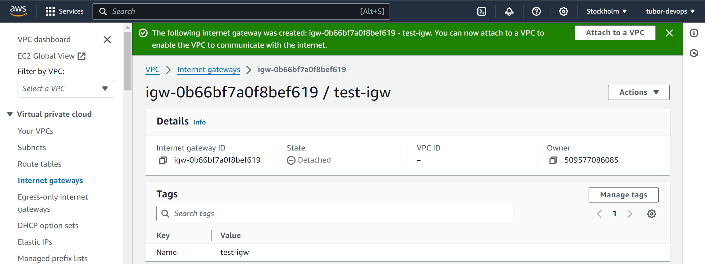
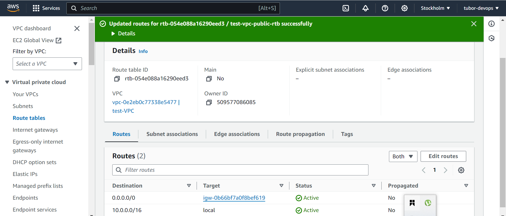
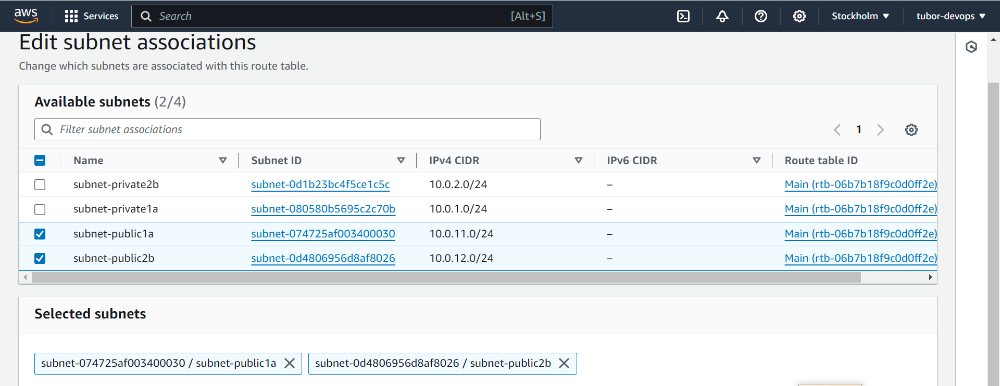
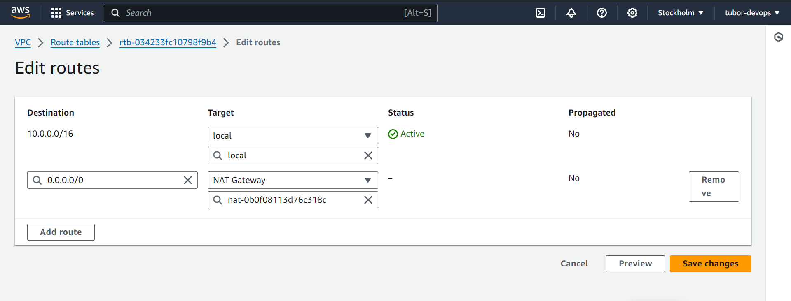
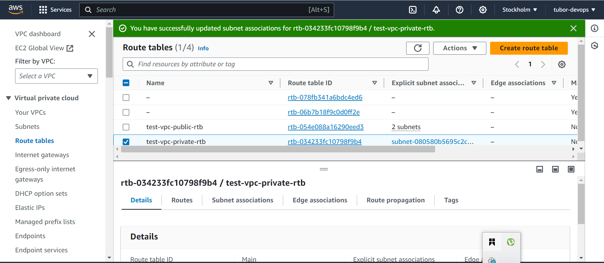

## _AWS Network Impelementation (VPC, Subnets, IG,NAT, Routing)_

### _creating vpc_

vpc stands for virtual private cloud on Amazon cloud where you can manage resources(like servers or databases). You control who and what goes in and out.AWS cloud platform has a default VPC that can be use if you decided not to create one, all that is needed is for you to edit it for your specific needs.
As seen in the image, a vpc was created tag "test-VPC".

### _creating subnets_

subnets are like smaller segments within a VPC that help you organize and manage your resources. subnets are created to organize and manage the network effectively.
four(4) different subnets were created according to the manual/guide. two(2) as public while the other two(2) as private subnets.

### _creating internet gateway_

IG is a service on AWS that allows for inbound and outbound traffics to the internet from a public subnet. For a subnet to be public, an Internet gateway must be created and attached to the VPC and subnet with a route table configured.

### _internet gateway attached to VPC_

As seen in the image, the IG created was attached to the VPC _"test-VPC"_.

### _creating route table_

After creating the IGW, the route table is what gives direction to our resources. Guiding the resources on how to get in and out of our VPC. The route table was created with a name tag "test-vpc-public-rtb", route table edited and default route was added to the IGW(internet Gateway).

### _default route add_

Route table was edited and the default route was added. This will allow inbound and outbound traffic between the resources within the public subnet and the internet.

### _public subnet attached to route table_

The public subnets as expected was attached to route table for free flow of communication between the resources in the subnets and the internet.

### _creating private route table_

A route table with a target to NAT gateway is a private route table.

### _creating NAT gateway_

In AWS virtual private cloud(VPC), private subnets are secluded areas where you can place resources that should not be directly exposed to the internet. But when this resources need access to the internet for updates or downloads, then there is a need for NAT gateway. So the NAT gateway is linked with the private subnets to connect to outside services.

### _route table edited_

The route table was created for the private-subnet. This is also edited to capture the newly created NAT-gateway.

### _route table update_

A route table was created for both the private and public subnets. Two subnets was attached to the route table created for public subnet while a subnet was attached the route table created for the private subnet. This can be noticed in the image.

I have learnt how to create a VPC and all needed resources associated with it. Thank you
